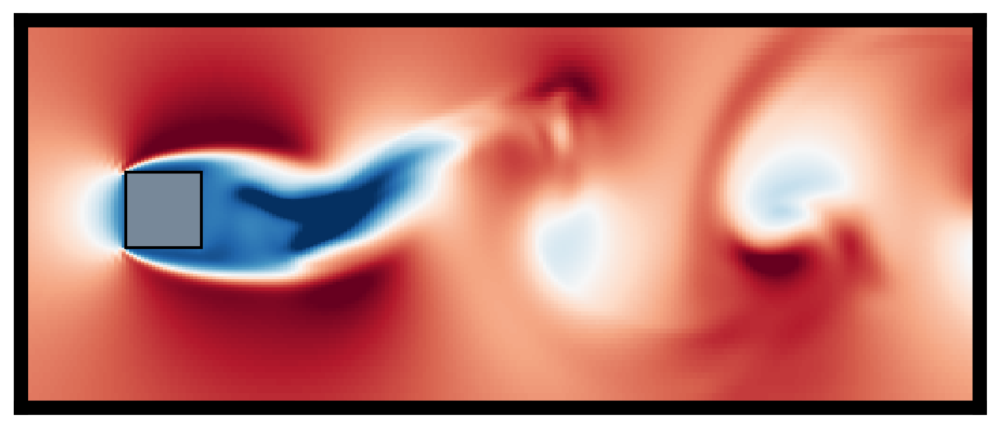
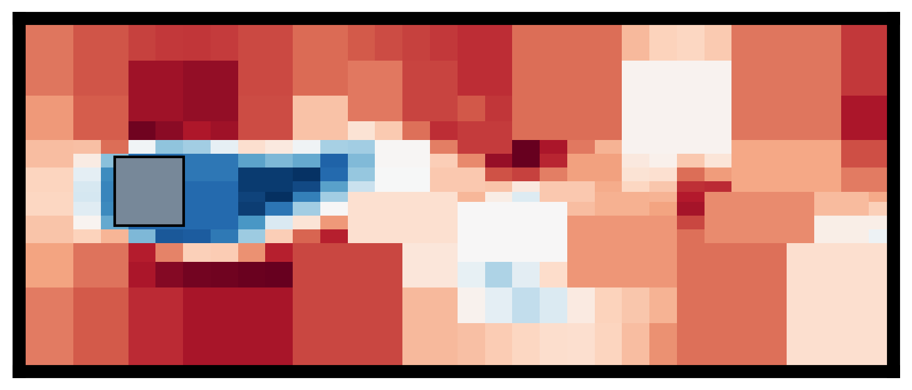

# 2D-3D CNN for three-dimensional reconstruction from two-dimensional cross-sections of fluid flows
This repository contains sample source codes utilized in part of "Reconstructing three-dimensional bluff body wake from sectional flow fields with convolutional neural networks," [SN Computer Science, 5, 306, 2024](https://link.springer.com/article/10.1007/s42979-024-02602-0): [arXiv:2103.09020, 2021](https://arxiv.org/abs/2103.09020)

A 2D-3D CNN is trained to estimate a three-dimensional flow field from its two-dimensional cross-sections. 

| DNS | ML |
|:---:|:---:|
|  |  |

Flows around a square cylinder computed by direct numerical simulation (DNS) and estimated by ML from 5 cross-sections.

| Original | Adaptive sampling |
|:---:|:---:|
|  |  |

Example of an adaptive-sampled field. 

# Information
  Author: Mitsuaki Matsuo ([Keio University](https://kflab.jp/en/)) and [Kai Fukami](https://sites.google.com/view/kai-fukami/home?authuser=0)

This repository contains 
- 2D-3D-CNN.py
- Adaptive-sampling.py 

Authors provide no guarantees for this code. Use as-is and for academic research use only; no commercial use allowed without permission. The code is written for educational clarity and not for speed.

# Requirements
- Python 3.x  
- Keras  
- Tensorflow  
- sklearn
- numpy
- skimage

# Reference
M. Matsuo, K. Fukami, T. Nakamura, M. Morimoto, K. Fukagata, "Reconstructing three-dimensional bluff body wake from sectional flow fields with convolutional neural networks," [SN Computer Science, 5, 306, 2024](https://link.springer.com/article/10.1007/s42979-024-02602-0) (preprint: [arXiv:2103.09020 [physics.flu-dyn]](https://arxiv.org/abs/2103.09020))
