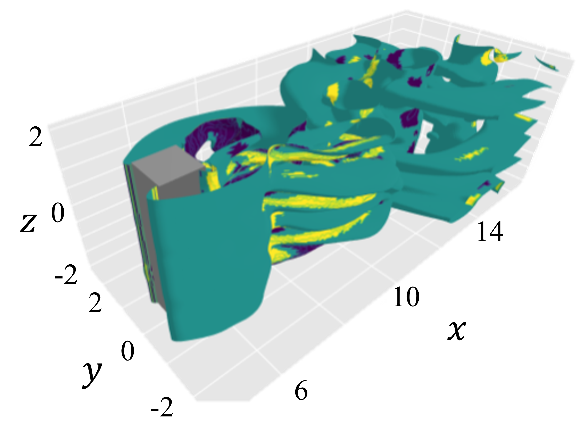
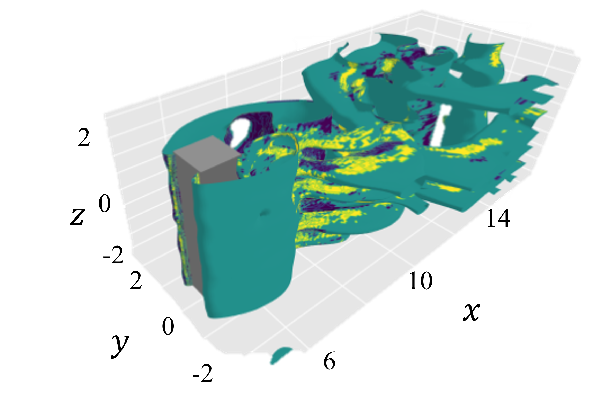

# 2D-3D CNN for three-dimensional reconstrcution from two-dimentional cross-sections of fluid flows
This repository contains a sample source code utilized in a part of "Supervised convolutional network for three-dimensional fluid data reconstrcution from sectional flow fields with adaptive super-resolution assistance," preprint: [arXiv:2103.09020, 2021](https://arxiv.org/abs/2103.09020)

A 2D-3D CNN is trained to estimate three-dimensional flow field from its two-dimensional cross-sections. 

| DNS | ML |
|:---:|:---:|
|  |  |

Flows around a square cylinder computed by direct numerical simulation (DNS) and estimated by ML from 5 cross-sections.

# Information
  Authour: Mitsuaki Matsuo ([Keio university](https://kflab.jp/en/))

This repository contains a sample py file: 2D-3D-CNN.py 

Authors provide no guarantees for this code. Use as-is and for academic research use only; no commercial use allowed without permission. The code is written for educational clarity and not for speed.

# Requirements
- Python 3.x  
- Keras  
- Tensorflow  
- sklearn

# Reference
M. Matsuo, T. Nakamura, M. Morimoto, K. Fukami, K. Fukagata, ``Supervised convolutional network for three-dimensional fluid data reconstruction from sectional flow fields with adaptive super-resolution assistance," 2021 (preprint, [arXiv:2103.09020 [physics.flu-dyn]](https://arxiv.org/abs/2103.09020))
